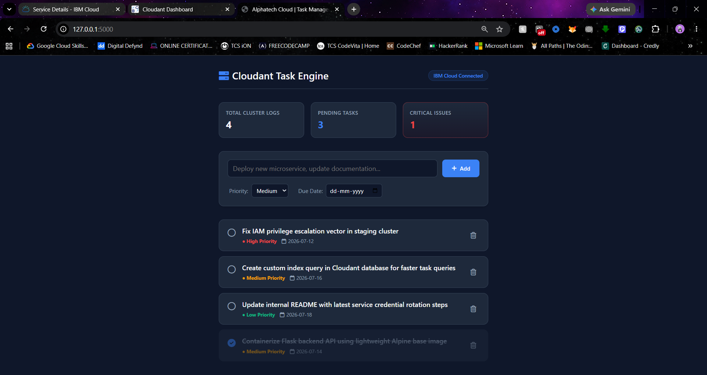
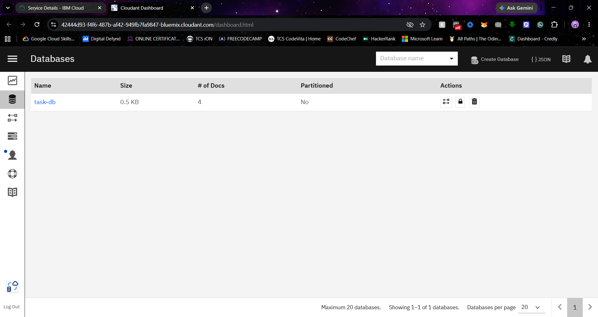
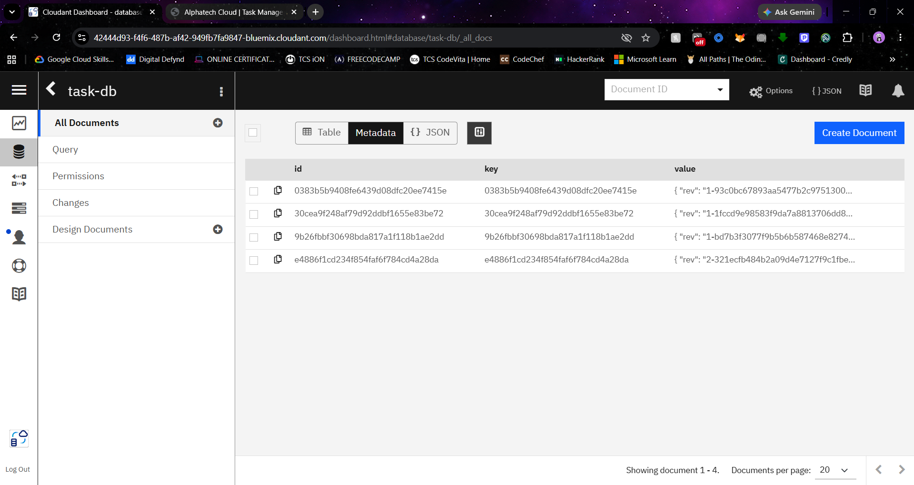

# 🌐 Cloudant Task Engine — DevOps Architecture CRUD Console

A cloud-native operational task engine engineered for full-stack data mutation pipelines. This system integrates an asynchronous backend engine with a remote enterprise-grade **IBM Cloudant NoSQL database** cluster, designed specifically to demonstrate dynamic analytics mapping and structural document architecture.

---

## 🚀 Architectural Blueprint & Features

### 📊 Real-Time KPI Analytics Dashboard
* **Dynamic Cluster Logs Tracking:** Monitors full document index length actively across the remote database setup.
* **Observe Pending Operations:** Computes real-time execution states dynamically using backend Python logic right before view instantiation.
* **Critical Error Aggregations:** Instantly flags high-severity exceptions, sorting document properties instantly to isolate vulnerabilities.

### 🛡️ Production Engineering Features
* **Full CRUD Lifecycle Integration:** Implements clean *Create, Read, Update,* and *Delete* sequences natively mapped to unstructured JSON documents.
* **State Preservation via Mutation:** Leverages unique document tracking (`_id` and revision `_rev` tokens) to toggle status values instantly in the cloud without data dropping.
* **DevOps Observability Interface:** Crafted with an advanced micro-metric dark-theme styling rule sheet for crisp usability.

---

## 🛠️ Technology Stack

* **Backend Framework:** Python Flask
* **Cloud Database Server:** IBM Cloudant (Apache CouchDB Engine)
* **API Integration Core:** `ibmcloudant` SDK Core Library & IAM Token Authentication
* **Interface UI Styling:** Semantic HTML5, CSS Grid Foundations, FontAwesome Iconography

---

## 📦 Local Installation Guide

1. Clone this cloud repository down to your computer workspace, navigate into the directory, install the required dependencies, and launch the server:
   ```bash
   git clone https://github.com/teachmetech08/Cloudant-CRUD-App.git
   cd Cloudant-CRUD-App
   pip install -r requirements.txt
   python app.py

---

## 🖥️ System Interface & Cloud Infrastructure Verification

### 1. Cloudant Task Engine User Interface
The application frontend dashboard displays responsive operational logs, critical metric counters, and integrated CRUD states executing locally:



### 2. Remote IBM Cloudant Database Instance
Verification of the live cloud instance `task-db` securely provisioned and running within the IBM Cloud infrastructure:



### 3. Live NoSQL Data Persistence Layer
A transparent view inside the `task-db` collection, demonstrating the unstructured JSON schemas mapping directly to the active web interface rows:

